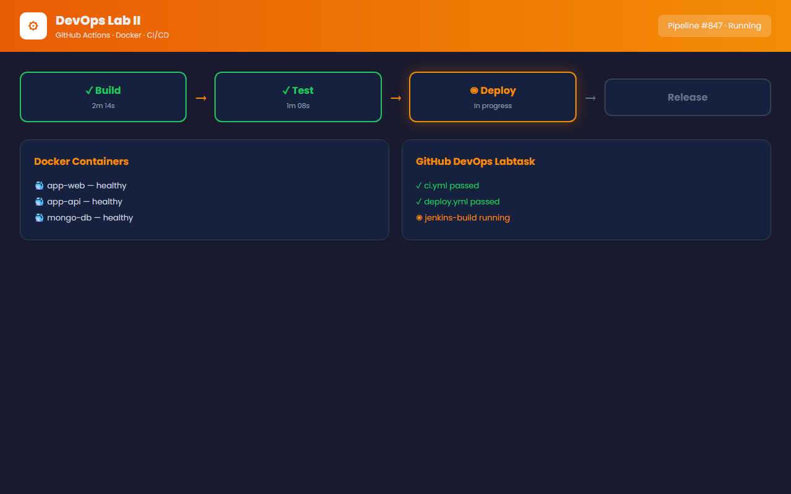



# DevOps Lab Project 2

**Second DevOps lab project for practicing GitHub-based workflows, repository management, deployment basics, and CI/CD concepts.**

DevOps, GitHub, Docker, Jenkins, CI/CD

---

## Screenshots

## Overview

Second DevOps lab project for practicing GitHub-based workflows, repository management, deployment basics, and CI/CD concepts.

## Highlights

- Clean repository documentation with a project-specific summary.
- Screenshot section when captured portfolio media is available.
- Search-friendly tags for portfolio and GitHub discovery.
- Maintained by [Muhammad Afzal Kalwar](https://github.com/mafzalkalwardev).

## Quick Start

Clone the repository and review the source files for setup or usage details:

``bash
git clone https://github.com/mafzalkalwardev/devops2.git
cd devops2
``

## Author

Muhammad Afzal Kalwar - Full-Stack Developer and Python Automation Engineer  
Portfolio: https://mafzalkalwardev.github.io
